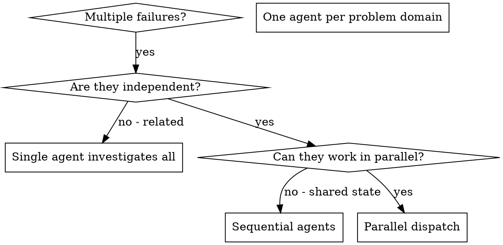

# Dispatching Parallel Agents

## Overview

You give tasks to specialized agents that have an isolated context. You write their instructions and context precisely, so they stay focused and complete their task. They should never inherit the context or history of your session. You construct exactly what they need. This also keeps your own context free for coordination work.

You can have more than one unrelated failure (different test files, different subsystems, different bugs). If you investigate them one after the other, you lose time. Each investigation is independent, and the investigations can occur in parallel.

**Core principle:** Dispatch one agent for each independent problem domain. Let them work at the same time.

## When to Use



**Use this skill in these conditions:**
- 3+ test files fail with different root causes.
- More than one subsystem is broken independently.
- An agent can understand each problem without context from the other problems.
- The investigations have no shared state.

**Do not use this skill in these conditions:**
- The failures have a relation (a fix for one failure can fix the others).
- You must understand the full system state.
- The agents can interfere with each other.

## The Pattern

### 1. Identify Independent Domains

Put the failures into groups by the broken part:
- File A tests: Tool approval flow
- File B tests: Batch completion behavior
- File C tests: Abort functionality

Each domain is independent. A fix to tool approval does not affect the abort tests.

### 2. Create Focused Agent Tasks

Each agent gets:
- **Specific scope:** One test file or subsystem
- **Clear goal:** Make these tests pass
- **Constraints:** Do not change other code
- **Expected output:** A summary of what you found and fixed

### 3. Dispatch in Parallel

Send all three subagent dispatches in the same response. Then they run in parallel:

```text
Subagent (general-purpose): "Fix agent-tool-abort.test.ts failures"
Subagent (general-purpose): "Fix batch-completion-behavior.test.ts failures"
Subagent (general-purpose): "Fix tool-approval-race-conditions.test.ts failures"
# All three run concurrently.
```

More than one dispatch call in one response = parallel execution. One call in each response = sequential execution.

### 4. Review and Integrate

When the agents return:
- Read each summary.
- Verify that the fixes do not conflict.
- Run the full test suite.
- Integrate all changes.

## Agent Prompt Structure

Good agent prompts are:
1. **Focused** - One clear problem domain
2. **Self-contained** - All the context that the agent needs to understand the problem
3. **Specific about output** - What must the agent return?

```markdown
Fix the 3 failing tests in src/agents/agent-tool-abort.test.ts:

1. "should abort tool with partial output capture" - expects 'interrupted at' in message
2. "should handle mixed completed and aborted tools" - fast tool aborted instead of completed
3. "should properly track pendingToolCount" - expects 3 results but gets 0

These are timing/race condition issues. Your task:

1. Read the test file and understand what each test verifies
2. Identify root cause - timing issues or actual bugs?
3. Fix by:
   - Replacing arbitrary timeouts with event-based waiting
   - Fixing bugs in abort implementation if found
   - Adjusting test expectations if testing changed behavior

Do NOT just increase timeouts - find the real issue.

Return: Summary of what you found and what you fixed.
```

## Common Mistakes

**❌ Too broad:** "Fix all the tests" - the agent gets lost
**✅ Specific:** "Fix agent-tool-abort.test.ts" - the scope is narrow

**❌ No context:** "Fix the race condition" - the agent does not know where
**✅ Context:** Paste the error messages and test names

**❌ No constraints:** The agent can refactor all the code
**✅ Constraints:** "Do NOT change production code" or "Fix tests only"

**❌ Vague output:** "Fix it" - you do not know what changed
**✅ Specific:** "Return summary of root cause and changes"

## When NOT to Use

**Related failures:** A fix for one failure can fix the others. Investigate them together first.
**Need full context:** To understand the problem, you must see the full system.
**Exploratory debugging:** You do not know yet which part is broken.
**Shared state:** The agents can interfere (they edit the same files or use the same resources).

## Real Example from Session

**Scenario:** 6 test failures in 3 files after a large refactor

**Failures:**
- agent-tool-abort.test.ts: 3 failures (timing issues)
- batch-completion-behavior.test.ts: 2 failures (tools do not execute)
- tool-approval-race-conditions.test.ts: 1 failure (execution count = 0)

**Decision:** Independent domains. The abort logic, the batch completion and the race conditions are separate.

**Dispatch:**
```
Agent 1 → Fix agent-tool-abort.test.ts
Agent 2 → Fix batch-completion-behavior.test.ts
Agent 3 → Fix tool-approval-race-conditions.test.ts
```

**Results:**
- Agent 1: Replaced the timeouts with event-based waits
- Agent 2: Fixed an event structure bug (threadId in the wrong place)
- Agent 3: Added a wait for the async tool execution to complete

**Integration:** All fixes were independent, with no conflicts. The full suite was green.

## Verification

After the agents return:
1. **Review each summary** - Understand what changed.
2. **Look for conflicts** - Did the agents edit the same code?
3. **Run the full suite** - Verify that all fixes work together.
4. **Spot check** - Agents can make systematic errors.
