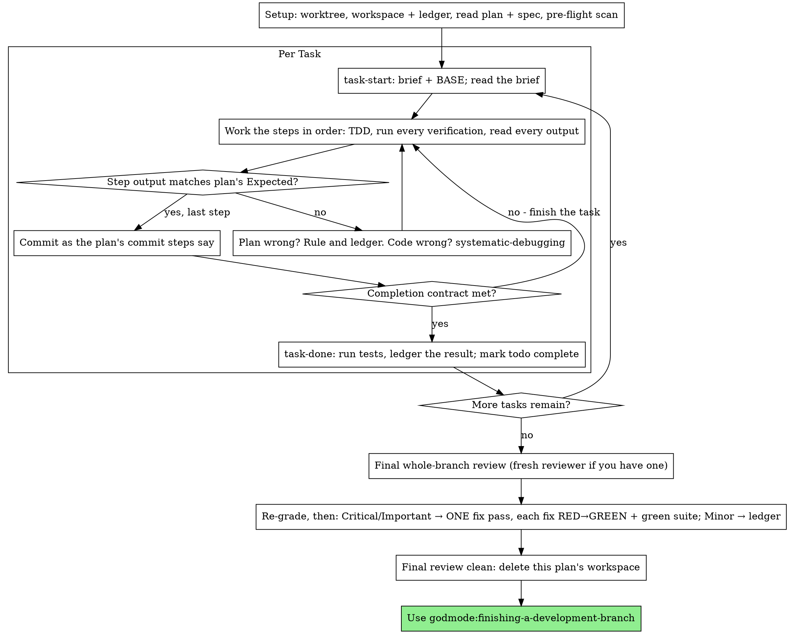

# Executing Plans

Execute the plan yourself, one task at a time, in this session. Do not use
an implementer subagent or a reviewer for each task. At the end, one
reviewer with a fresh context reviews the whole branch.

**Why inline:** Subagent-driven development pays for a fresh implementer
and a fresh reviewer on each task. Each of them reads the codebase again
from zero. Inline execution pays for one context (yours) and one reviewer
at the end. It loses a fresh context for each task and a second pair of
eyes for each task. This skill keeps what those two things gave, with
other methods. The brief is the spec, and the ledger is your memory. TDD
is the gate for each task, and the final reviewer is the second pair of
eyes.

**Core principle:** The plan already did the thinking. Execute it exactly.
Prove each step with a test that you saw fail and then pass. Leave a
record that stays when you forget.

**Skill calls, not recollections.** After you read the plan, your first action is a skill call to `godmode:test-driven-development`. Do it before Task 1, also when you know TDD and the steps of the plan already state RED and GREEN. Before the final review, call `godmode:verification-before-completion`. Also call it before each message that says that the work is complete.

**Narration:** Between tool calls, write one short line or less. The
ledger and the tool results keep the record.

**Continuous execution:** Between tasks, do not stop to ask your human
partner for a status talk. They chose inline execution to spend less. They
did not choose it to answer "should I continue?" after each task. Execute
all tasks from the plan without a stop.

**Rulings, not stalls.** Decide conflicts, ambiguities and plan defects
yourself. The spec is the binding authority, and the plan is its argument.
Your judgment decides what neither of them answers. Record each decision in
the ledger as `Ruling: <what you decided> — <why> — <what it costs if wrong>`.
Then continue. A deviation from the plan without a ruling in the ledger is
a decision made in secret.

Four things stop you, and only these four:

- An irreversible or destructive operation.
- A security-sensitive action.
- A side effect outside this worktree that norms say you ask about first
  (a merge, a push to a shared branch, a publish).
- A plan so broken that each path forward is a guess.

For those four things, stop and ask.

Sometimes a step that only a human can do blocks you. Examples are: make a
credential, set a CI secret, click through a third-party dashboard or run a
one-off cutover. Then invoke godmode:wizard to make the script that guides them
through the step. Do a static check of the script. Then:

- Ledger the task as `Task <N>: blocked on human: <step> — wizard at <path>`.
  The task is not complete. Do not use placeholder values. Do not use a
  mock in place of the real credential. Do not write a completion line.
- Continue with the remaining tasks that do not depend on it, in plan
  order. Stop before the first task that uses the output of the blocked
  task. Also stop before the final review. A branch with a blocked task
  never goes to the final review or to finishing-a-development-branch.
- Put the wizard path and the blocked task at the top of your final
  message, before the rulings list.

Never paste the manual steps into chat, and never ask your partner to paste
a secret to you.

## When to Use

- You have a plan from godmode:writing-plans, and your human partner
  chose inline execution at the handoff.
- Your harness has no subagent tool (see the references for each platform in
  `../using-godmode/references/`). Never make up a dispatch. Run
  the plan here.
- Most tasks are independent. This is the same precondition as
  godmode:subagent-driven-development.

With a fully specified plan, inline execution is transcription and tests.
It runs well on a mid-tier session model. The most capable model is worth
its cost in one place only: the final review. This skill dispatches that
review separately. Tell your human partner this when they choose inline.

Prefer godmode:subagent-driven-development when your human partner
wants a review gate on each task. Also prefer it when the plan is so long that
its later tasks would run on a compacted context. Inline execution on a
long plan still works, because the ledger makes it recoverable. But the
last tasks get the least of your attention.

## The Process



## Setup

Make sure that the work occurs in an isolated workspace. Use
godmode:using-git-worktrees to make one or to verify the existing one.
Never start implementation on a main/master branch without the explicit
consent of your human partner.

Conversation memory does not stay after compaction. An inline executor that
loses its place implements tasks again when their commits already exist.
This is the same failure as a controller that dispatches them again, but
you pay for it in your own context. Record progress in a ledger file, not
only in todos. Harness todos are a live view. The ledger is the record.

This skill and godmode:subagent-driven-development share the workspace and
the ledger, with the same directory and the same format. Thus a plan can
change executors during the work, and the new executor continues from the
same ledger.

- Each plan has its own workspace. At skill start, run
  `../subagent-driven-development/scripts/sdd-workspace PLAN_FILE`. It
  prints the git-ignored directory of the plan
  (`<repo-root>/.godmode/sdd/<plan-basename>/`). This directory holds each
  artifact for THIS plan: ledger, briefs, review packages. The directory of a
  different plan is never yours to read or write.
- Look for the ledger of this plan at `<workspace>/progress.md`. If its first
  line names your plan file, tasks with a `Task <N>: complete` line are
  DONE. Do not do them again. Continue at the first task without one. Their
  commits exist in git, also when your context does not remember them.
  After compaction, trust the ledger and `git log` more than your own
  memory. A ledger whose first line names a different plan file is the
  progress of a different plan. Leave it, and start a new ledger of your own.
- Make the ledger with its identity as the first line:
  `# SDD ledger — plan: <plan file path>`.
- `git clean -fdx` will destroy the workspace (it is git-ignored scratch).
  If that occurs, recover from `git log`.

Read the plan one time. Note its context and Global Constraints, and make
a todo for each task. If the plan names a Spec, read it too. The spec is
the authority for the argument of the plan, and it decides conflicts in the
plan. If the plan has no spec that you can get, write a ledger note that
says so. Rulings without a spec are provisional.

**REQUIRED SUB-SKILL:** Load godmode:test-driven-development now,
before Task 1. It controls each step of each task below. A plan whose
steps already say "write the failing test first" does not let you skip
it.

Before Task 1, look for conflicts between tasks in the plan. The
Interfaces blocks of the plan tell you where to look. For each task that
uses the output of an earlier task, write one ledger row. The row gives the
two tasks, the output of one compared with the input of the other, and what
you found. Tasks that share nothing get no row. If no tasks share
anything, write the single line `Pre-flight: no shared interfaces`. Rule on
each conflict that a row shows, with the spec as the binding authority.
Record the ruling next to its row, and start Task 1. You verify the text
of each task when you read its brief, not here.

## The Task Loop

All that you print, and each tool result, stays in your context for the
rest of the session. Send long test output to a file in the workspace, and
read its tail. Read a brief, not the whole plan.

### 1. Take the task

- Run the `scripts/task-start PLAN_FILE N` of this skill. In one call, it
  prints the brief path and BASE (the commit where the range of the task
  starts). Read the brief for each task, also for tasks that you remember
  from setup. What you remember is a summary. The brief has the exact values,
  signatures and test cases.
- Mark the todo of the task in_progress.

Each tool call is a turn that reads your whole context again. Do the
bookkeeping in the same call as the work. Append to the ledger in the same
call as the commit, never in a call of its own.

### 2. Work the steps

The steps of the plan are already in RED-GREEN order. Do them in that
order under godmode:test-driven-development, which you loaded at setup.
At the start of each task, verify its "Seam under test". Each test goes
through that public interface. If the seam cannot get to the behavior, the
plan has a defect. Rule on a seam with the godmode:codebase-design
vocabulary, and ledger it. Run the typechecker (if the project has one)
and the focused test file regularly. The full suite runs at `task-done`.
If you see smells outside the minimal change, write them in the ledger as
`Task <N>: refactor note: <one-liner>` for the final Standards review,
never into the current task. For a factual question about a
library or API, use godmode:research, not a guess. Write the code of a test
step first and run it first. To see it fail is a step, not a formality.
If a test passes before the implementation exists, that is a finding
about the test.

Each step that runs a command has an `Expected:` line. Run the command,
read its output, and compare. There are three outcomes:

- **Matches.** Go to the next step.
- **The code is wrong.** Use godmode:systematic-debugging. Find the
  cause, and never patch the symptom to make the output of the step match.
- **The plan is wrong.** For example, a step contradicts the spec. Or, an
  interface from an earlier task does not match the input of this task. Or,
  a command cannot work. Rule on the smallest change that satisfies the
  spec. Ledger it as `Task <N>: Ruling: <finding> — <what you decided and why>`,
  and continue. The ledger carries the ruling, not your memory. Later tasks
  that touch the same interface read it from the ledger.

Commit as the commit steps of the plan say. A task can have several
commits. The review range starts at BASE, never at `HEAD~1`.

### 3. The completion contract

Before you write the ledger line of a task, all of these must be true.
You must have evidence from this session. A diff that looks right is not
evidence.

- Each test that the brief names exists and ran in this task, and you read
  the output.
- The final test run for the task passed. `task-done` is that run, and
  it writes the command and the result into the ledger line.
- You compared each `Expected:` line in the brief with real output.
- Each deviation from the brief has a `Ruling:` line in the ledger.

**REQUIRED SUB-SKILL:** godmode:verification-before-completion controls
the claim. If one item is missing, the task is not complete. Finish it.

### 4. Complete the task

Run the `scripts/task-done PLAN_FILE N BASE -- <test command>` of this
skill. Use the test command that the brief names for the whole task. The
script runs the tests and keeps the full output in the workspace. It prints
the tail. Only if the tests pass, it appends the completion line to the
ledger:

`Task <N>: complete (commits <base7>..<head7>, tests: <command> → <result>)`

A run that fails records nothing, and the task is not complete. When the
script records the line, mark the todo complete and take the next task.

## Final Review

Run `../subagent-driven-development/scripts/review-package PLAN_FILE MERGE_BASE HEAD`
(MERGE_BASE is the commit where the branch started, for example
`git merge-base main HEAD`). Review from the file that it prints.

**With a subagent tool:** Run the two-axis review of
godmode:requesting-code-review. Start a Standards subagent and a Spec
subagent in parallel. Use the most capable available model for both,
because the whole-branch review is a judgment task. Make both from
[code-reviewer.md](../requesting-code-review/code-reviewer.md). Give the
Standards subagent also
[fowler-smells.md](../requesting-code-review/fowler-smells.md) and the
`refactor note` lines of the ledger. Give both subagents these items:

- The package path.
- The plan path and the spec path.
- The Review Focus section of the plan word for word, if it has one. This
  section gives the input classes and failure modes that the tests of the
  plan do not exercise. The reviewer examines each of them on purpose.
- A pointer to the `Ruling:` lines of the ledger, so that the reviewer can
  weigh your decisions.

Specify the model explicitly. If you do not give a model, the subagent
gets the model of the session, which may not be the most capable. This is
the one fresh context that the whole run pays for. Do not skip it. Do not
replace it with your own read of the diff. Dispatch the security pass
(`godmode:vuln-scan` in review mode on MERGE_BASE..HEAD) as a third
parallel subagent. It always runs here.

**Without a subagent tool:** Read code-reviewer.md and fowler-smells.md.
Do that review yourself on the package, as a separate pass after the
ledger line of the last task. Then run `godmode:vuln-scan` in review mode
yourself. Report Standards, Spec and Security under separate headings with
separate verdicts. Write `Final review: self-review (no subagent tool)` to the
ledger, and say so in your final message. A self-review by the author is
weaker than a fresh reviewer. Your human partner decides if that is
sufficient before merge.

Sort the findings before you act on one of them. The severity labels of
the reviewer are advice. You control the gate. The "Declined to judge" list
of the reviewer is also yours. Each line in it is a ruling that you make
and ledger, the same as a plan conflict:
`Final: Ruling: <behavior the reviewer set aside> — <what a reasonable person using this software gets, and why that stands or why it is now a finding> — <cost if wrong>`. First, grade again by
effect. The spec is a vision document. The grade of a finding is what a
reasonable person who uses this software gets if it ships. It is not
whether the spec names the input that causes it. If a reviewer set a
finding at Minor because the spec said nothing, that reviewer graded the
spec, not the effect. Then:

- **Critical and Important** findings go into the fix pass.
- **Minor** findings go to the ledger as `Final: minor (deferred): <one-liner>`
  and to your final message under "Deferred minors". Minors never go into
  the fix pass, and never become rulings. A ruling is a decision about a
  conflict, not a note that you refused a polish suggestion.

Fix the Critical and Important findings yourself, because you are the
implementer here. Do it in ONE pass. TDD verifies each fix, not a
second reviewer. Write the test that reproduces the finding, and see it
fail. Make it pass, and then run the whole suite. Record each fix in the
ledger as `Final: fixed <finding> — <test name> RED→GREEN, suite <N>/<N>`.
A fix without a test that failed first is not verified. If the suite is
not green after the pass, the pass is not complete. Do not dispatch a
second review. It would read a diff again when its tests already answer
"addressed" and its suite run already answers "broke nothing".

If you decide not to fix a finding, that is a ruling:
`Final: Ruling: <finding> — <why the code stands> — <cost if wrong>`. It goes to your human partner
in the rulings list. There is no second fix pass.

## Finish

Before you remove anything, find each ledger line with `Ruling:` in it.
Put these lines into your final message under "Rulings I made".
Keep the order in which you made them, and give the cost if wrong for each. Put each
`minor (deferred)` line under "Deferred minors". Both lists are complete.
Your human partner sees the decisions that you made for them only in your
final message. The same is true for the findings that you did not act on.

When the final review is clean and you committed its fixes, remove the
workspace directory of this plan. The git history is now the record. The
sibling directories belong to other plans. Do not touch them.

Use godmode:finishing-a-development-branch.

## Common Rationalizations

| Excuse | Reality |
|--------|---------|
| "I remember what Task N says" | You remember a summary. The brief has the exact values. Read it. |
| "The plan's code is right, skip watching the test fail" | A test that you never saw fail proves nothing. It is one step. Run it. |
| "I'll run the full suite at the end instead of per step" | Runs after each step show which step broke it. The run at the end of the task is the contract, not a replacement. |
| "The plan is wrong here, I'll just do the right thing" | Do the right thing and ledger the ruling. A deviation that is not in the ledger is a decision made in secret. |
| "I'll write the ledger lines after a few tasks" | Compaction does not wait for a good moment. Write one line for each task, in the same message as the commit. |
| "Let me check in before the next task" | They chose inline to spend less. Progress questions spend their time. Only the four stops stop you. |
| "I read my own diff carefully; the final reviewer is redundant" | The same author has the same blind spots. The reviewer is the only fresh context that this run pays for. |
| "Tests should pass, the change was trivial" | "Should" is not evidence. The contract requires the command and its output. |
| "Subagents are slow and expensive, I'll skip the final review too" | Inline already removed the reviewers for each task. One review of the whole branch is the minimum, not the maximum. |
| "The reviewer said Minor, so it's Minor" | The label graded the silence of the spec. Grade what the person gets. Grade again, then use the gate. |
| "The fix is obvious, no need for a failing test first" | The failing test is the only proof that the finding was real and is now gone. Without it, you have a diff and a hope. |
| "I'll fix the minors too while I'm in there" | Each minor that you fix is a test, a fix and a suite run that your partner did not ask for. Ledger them. Your partner decides. |

## Example Workflow

```
You: I'm using the executing-plans skill to implement this plan inline.

[Setup: worktree verified]
[Read plan once: docs/godmode/plans/feature-plan.md; spec read]
[Resolve workspace: sdd-workspace docs/godmode/plans/feature-plan.md — no ledger inside, fresh start]
[Pre-flight scan: 2 shared-interface rows, 4 self-consistency rows, clean; written to ledger]
[Create todos for all tasks]

Task 1: Hook installation script

[task-start plan 1 → brief read; BASE a1b2c3d]
[Step 1: write failing test — written]
[Step 2: run it — FAIL: install_hook not defined. Matches Expected.]
[Step 3: implement — written]
[Step 4: run it — PASS 1/1. Matches Expected.]
[Step 5: commit — d4e5f6a]
[Contract: tests ran, output read, no deviations]
[task-done plan 1 a1b2c3d -- npm test -- hooks → ledger: Task 1: complete (commits a1b2c3d..d4e5f6a, tests: npm test -- hooks → 1/1 pass)]

Task 2: Recovery modes

[task-start plan 2 → brief read; BASE d4e5f6a]
[Step 2: run failing test — FAIL, but on an import error: Task 1 exported
 installHook, brief consumes install_hook]
[Ruling: brief's consumer name is a typo against Task 1's Produces block;
 use installHook — Ledger: Task 2: Ruling: install_hook → installHook — matches Task 1 Produces — cost if wrong: one rename]
[Steps 2-5 as planned; commit b7c8d9e]
[task-done plan 2 d4e5f6a -- npm test -- recovery → ledger: Task 2: complete (commits d4e5f6a..b7c8d9e, tests: npm test -- recovery → 8/8 pass)]

...

[After all tasks: review-package plan MERGE_BASE HEAD; dispatch code-reviewer, most capable model]
Reviewer: One Important finding — progress reporting interval hardcoded. Two Minor.
[Re-grade: Important stands; minors → ledger as deferred]
[Fix pass: test_progress_interval_configurable RED → extract PROGRESS_INTERVAL → GREEN; suite 12/12; commit]
[Ledger: Final: fixed hardcoded interval — test_progress_interval_configurable RED→GREEN, suite 12/12]

Rulings I made:
- Task 2: install_hook → installHook (brief typo; cost if wrong: one rename)

Deferred minors:
- README lacks a usage example
- recovery.js could split verify/repair into two files

[Delete this plan's workspace — the record now lives in git]

Using godmode:finishing-a-development-branch.
```
