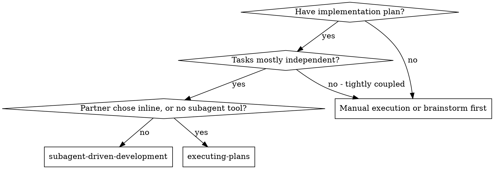
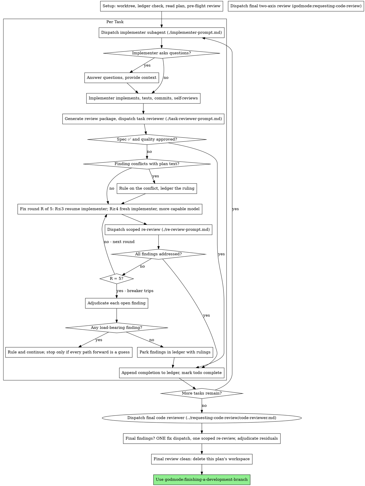

# Subagent-Driven Development

Execute a plan with a fresh implementer subagent for each task. After each task, do a task review (spec compliance + code quality). At the end, do a broad whole-branch review.

**Why subagents:** You give tasks to specialized agents with isolated context. You write their instructions and context precisely, so they stay focused and succeed at their task. They should never inherit the context or history of your session — you construct exactly what they need. This also keeps your own context for coordination work.

**Core principle:** Fresh subagent per task + task review (spec + quality) + broad final review = high quality, fast iteration

**Narration:** between tool calls, narrate one short line at most. The
ledger and the tool results carry the record.

**Continuous execution:** Between tasks, do not pause to ask your human partner for input. Execute all tasks from the plan without a stop. Stop only for the four reasons below, or when all tasks are complete. "Should I continue?" prompts and progress summaries waste their time. They asked you to execute the plan, so execute it.

**Rulings, not stalls.** A running plan does not wait for a human. Decide
conflicts, ambiguities, plan defects and a cap that you would have asked to
exceed. The spec is the binding authority. The plan is its argument. Your
judgment settles what neither answers. Record each decision in the ledger as
`Ruling: <what you decided> — <why> — <what it costs if wrong>`, and
continue. A wrong ruling costs rework that your human partner can see and
undo. A session that stops on a question costs their whole day and buys nothing.

Only four things stop you. The first is an irreversible or destructive
operation. The second is a security-sensitive action. The third is a side
effect outside this worktree that norms tell you to ask about first. Examples
are a merge, a push to a shared branch and a publish. The fourth is a plan so broken that
every path forward is a guess. For these four, stop and ask.

Sometimes a step that only a human can do blocks you. Examples are the
minting of a credential, the setup of a CI secret, the clicks through a
third-party dashboard and a one-off cutover. In that case, invoke
godmode:wizard to generate the script that walks the human through the
step. Then verify the script statically yourself. Then:

- Ledger the task as `Task <N>: blocked on human: <step> — wizard at <path>`.
  The task is not complete. Do not use placeholder values, a mocked
  stand-in for the real credential or a completion line.
- Continue with the remaining tasks that do not depend on it, in plan
  order. Stop before the first task that consumes what the blocked task
  produces. Also stop before the final review. A branch with a blocked task
  never reaches the final review or finishing-a-development-branch.
- Put the wizard path and the blocked task at the top of your final
  message, before the rulings list.

Never paste the manual steps into chat, and never ask your partner to paste
a secret to you.

**Writing:** Write briefs, ledger lines and reports in STE (`godmode:ste-writing`). Use the procedural rules for briefs. Tell each subagent to write its report in descriptive STE.

## When to Use



**vs. Executing Plans (inline):**
- Fresh subagent per task (no context pollution) instead of one context that does every task
- Review after each task (spec compliance + code quality) instead of only at the end
- Costs a fresh context per task and per review. Inline costs one context plus one final reviewer
- Both run in this session, share the same plan workspace and ledger, and never pause between tasks

## The Process



## Setup

Make sure that the work happens in an isolated workspace. Use
godmode:using-git-worktrees to create one or to verify the existing one.
Never start implementation on a main/master branch without the explicit
consent of your human partner.

Conversation memory does not survive compaction. In real sessions,
controllers that lost their place re-dispatched entire completed task
sequences. That was the single most expensive failure on record. Track
progress in a ledger file, not only in todos.

- Each plan owns a workspace. At skill start, run this skill's
  `bash scripts/sdd-workspace PLAN_FILE`. It prints the git-ignored
  directory of the plan (under `<repo-root>/.godmode/sdd/`). This directory
  holds every artifact for THIS plan: ledger, briefs, reports, review
  packages. Do not read or write the directory of another plan.
- Look for the ledger of this plan at `<workspace>/progress.md`. If its first
  line names your plan file, each task with a `Task <N>: complete` line is
  DONE. Do not re-dispatch these tasks. Resume at the first task without one.
  If the last line of a task is a fix round, the task is mid-loop. Resume the
  loop at the next round. A ledger whose first line names a different plan
  file is the progress of another plan. A stray ledger at the old flat path
  `.godmode/sdd/progress.md` is also the progress of another plan. Leave such
  a ledger in place and start your own, fresh.
- Create the ledger with its identity as the first line:
  `# SDD ledger — plan: <plan file path>`.
- The ledger is your recovery map. The commits that it names exist in git,
  even when your context does not remember their creation. After compaction,
  trust the ledger and `git log` over your own memory.
- `git clean -fdx` will destroy the workspace (it is git-ignored scratch). If
  that happens, recover from `git log`.

Read the plan one time. Note its context and Global Constraints. Create a
todo for each task. If the plan names a Spec, read that too. The spec is the
authority that the plan argues from. Conflicts inside the plan resolve
against it. If the plan has no reachable spec, write a ledger note that says
so. Rulings that you make without a spec are provisional.

Before you dispatch Task 1, scan the plan one time for conflicts. Write down
what you verify while you verify it:

- tasks that contradict each other or the Global Constraints of the plan
- anything that the plan explicitly mandates and the review rubric treats as a
  defect (a test that asserts nothing, verbatim duplication of a logic block)

The output of the scan is a table, not a verdict. Write one row for each pair
of tasks that share a file or an interface. The row gives the two tasks, what
one produces against what the other consumes, and what you found. Write one
row for each task. The row tells whether the text of the task agrees with
itself. The row sets the tests it specifies against the code it specifies. It
also sets the files it creates against the files it later touches.
"The scan is clean" without those rows is not a scan that you ran.

Write the table to the ledger. Before execution starts, rule on everything
that you find. Weigh each finding against the plan text that mandates it.
Record each ruling in the ledger. If the scan is clean, proceed without
comment. Rule on each conflict that the scan shows. The spec is the binding
authority, and the plan is its argument. Record the ruling beside its row, and
dispatch Task 1. The review loop stays the net for conflicts that only emerge
from implementation.

## Model Selection

To keep cost low and speed high, use the least powerful model that can handle each role.

**Mechanical implementation tasks** (isolated functions, clear specs, 1-2 files): use a fast, cheap model. When the plan is well-specified, most implementation tasks are mechanical.

**Integration and judgment tasks** (multi-file coordination, pattern matching, debugging): use a standard model.

**Architecture and design tasks**: use the most capable available model.
The final whole-branch review is one of these tasks. Dispatch it on the most
capable available model, not the session default.

**Review tasks**: choose the model with the same judgment, scaled to the
size, complexity and risk of the diff. A small mechanical diff does not need
the most capable model. A subtle concurrency change does. Scoped re-reviews of
small fix diffs take a cheap-to-mid tier.

**Fix-loop escalation (rounds 4-5)**: use a model at least one tier above
the implementer that got stuck.

**Always specify the model explicitly when you dispatch a subagent.** If you
omit the model, the subagent inherits the model of your session. That model
is often the most capable and most expensive, and it silently defeats this
section.

**Turn count beats token price.** Wall-clock and context cost scale with the
number of turns that a subagent takes. The cheapest models routinely take 2-3×
the turns on multi-step work, and so they cost more overall. Use a mid-tier
model as the floor for reviewers and for implementers that work from prose
descriptions. If the plan text of the task contains the complete code to
write, the implementation is transcription plus testing. In that case, use
the cheapest tier for that implementer. Single-file mechanical fixes also take
the cheapest tier.

**Task complexity signals (implementation tasks):**
- Touches 1-2 files with a complete spec → cheap model
- Touches multiple files with integration concerns → standard model
- Requires design judgment or broad codebase understanding → most capable model

## The Task Loop

**Batch small same-shape work.** If the plan lists several tasks that are
each a small, independent edit of the same kind, do not dispatch one subagent
per task. Examples are the same one-line fix, constant change or field
addition, repeated across files. Compose ONE dispatch brief that lists every
file and its change. Send the whole batch to a single subagent. Review its
diff as one unit. Reserve one-dispatch-per-task for work that needs its own
judgment, its own tests or its own review surface.

Everything that you paste into a dispatch prompt stays resident in your
context for the rest of the session. Everything that a subagent prints back
also stays. You read all of it again on every later turn. Give artifacts as
files.

**Waiting on dispatched subagents:** never poll a wait interface with
short timeouts. Also, never sit in one silent, open-ended wait.
While you have local work, continue to work. Examples are ledger updates,
the package for the next review and reports to read. Child results arrive
on their own. When you are genuinely idle, wait in bounded stretches (five
to ten minutes, where your platform allows). Between stretches, post one
line of status and reconcile your live children. List them, and chase each
child that finished without a report. A bounded stretch keeps nearly all of
the efficiency of a long wait. It also makes sure that you notice a stuck or
lost child within minutes, not at the end of the session.

### 1. Dispatch the implementer

Before you dispatch, record BASE (`git rev-parse HEAD`). The review package
and the fix-round diffs need it.

- **Task brief:** before you dispatch an implementer, run this skill's
  `bash scripts/task-brief PLAN_FILE N`. It extracts the full text of the task
  to a uniquely named file and prints the path. Compose the dispatch so that
  the brief stays the single source of requirements. Your dispatch should
  contain five parts. (1) One line on where this task fits in the project.
  (2) The brief path, introduced as "read this first — it is your requirements, with the exact values to use verbatim".
  (3) Interfaces and decisions from earlier tasks that the brief cannot
  know. (4) Your resolution of any ambiguity that you noticed in the brief.
  (5) The report-file path and report contract. Exact values (numbers,
  magic strings, signatures, test cases) appear only in the brief. Never
  make a subagent read the whole plan file.
- **Report file:** name the report file of the implementer after the brief
  (brief `…/task-N-brief.md` → report `…/task-N-report.md`). Put it in the
  dispatch prompt. The implementer writes the full report there. It returns
  only status, commits, a one-line test summary and concerns.
- A dispatch prompt describes one task, not the history of the session. Do
  not paste accumulated prior-task summaries ("state after Tasks 1-3") into
  later dispatches. In a real session, a dispatch hit 42k chars, and 99% of
  it was history that the controller pasted. A fresh subagent needs its task,
  the interfaces it touches and the global constraints. Nothing else.
- The dispatch carries the no-subagents contract (it is in the
  implementer template). The implementer never dispatches subagents:
  not helpers, and never a reviewer. Review comes from you, after the
  report. In real sessions, each reviewer that a worker spawned duplicated
  the task review that the controller dispatched anyway. That was a full
  extra review seat per task.
- If an earlier task parked a finding in the area that this task touches,
  put a pointer to that ledger entry in the dispatch.
- Record the agent identity of the implementer from the dispatch result.
  Fix-loop rounds 1-3 resume this agent.
- Never dispatch multiple implementation subagents in parallel (conflicts).

Template: [implementer-prompt.md](implementer-prompt.md)

### 2. Handle the report

Implementer subagents report one of four statuses. Handle each status as follows:

**DONE:** Generate the review package (`bash scripts/review-package PLAN_FILE BASE HEAD`, from the directory of this skill). The script prints the unique file path that it wrote. BASE is the commit that you recorded before you dispatched the implementer. BASE is never `HEAD~1`, because that silently drops all but the last commit of a multi-commit task. Then dispatch the task reviewer with the printed path.

**DONE_WITH_CONCERNS:** The implementer completed the work but flagged doubts. Read the concerns before you proceed. If the concerns are about correctness or scope, address them before review. If they are observations (e.g., "this file is getting large"), note them. Then proceed to review.

**NEEDS_CONTEXT:** The implementer needs information that it did not get. Provide the missing context. Then re-dispatch. If the missing piece is a fact about a library, API or tool version and not a decision, get it with godmode:research. That skill is a background agent against primary sources. Give the implementer the research file path. If the missing piece is a seam that the "Seam under test" of the brief cannot reach, that is a plan defect. Rule on the seam with godmode:codebase-design vocabulary, ledger it, and re-dispatch.

**BLOCKED:** The implementer cannot complete the task. Assess the blocker:
1. If it is a context problem, provide more context and re-dispatch with the same model
2. If the task requires more reasoning, re-dispatch with a more capable model
3. If the task is too large, divide it into smaller pieces
4. If the plan itself is wrong, rule on the correction, ledger it, and re-dispatch with the ruling in the dispatch

**Never** ignore an escalation or force the same model to retry without changes. If the implementer said that it is stuck, something needs to change.

If the implementer asks questions, before it starts or mid-task, answer
clearly and completely. If necessary, provide additional context. Do not
rush it into implementation.

### 3. Review the task

Per-task reviews are task-scoped gates. The broad review happens one time, at
the final whole-branch review. Never skip the task review, and never accept a
report that does not have both verdicts. Spec compliance AND task quality are
both required. Implementer self-review never replaces the task review. Both
are necessary.

- Give the reviewer its diff as a file. Run this skill's
  `bash scripts/review-package PLAN_FILE BASE HEAD` and pass the reviewer the file path
  that it prints. Without bash, redirect `git log --oneline`, `git diff --stat`
  and `git diff -U10` for the range to one uniquely named file. The output
  never enters your own context. The reviewer sees the commit list, stat
  summary and full diff with context in one Read call. Use the BASE that you
  recorded before you dispatched the implementer. The BASE is never
  `HEAD~1`, because that silently truncates multi-commit tasks. Never
  dispatch a task reviewer without a diff file.
- **Reviewer inputs:** the task reviewer gets three paths: the same brief
  file, the report file and the review package. It also gets the global
  constraints that bind the task, the standards files of the repo and the
  absolute path to `../requesting-code-review/fowler-smells.md`.
- **Two axes, one seat.** The per-task reviewer returns two independent
  verdicts: Spec (Part 1) and Standards (Part 2: documented standards, the
  Fowler smell baseline, seam discipline). This is the Matt Pocock
  two-axis review, compressed into one reviewer to keep per-task cost flat.
  The final whole-branch review runs the two axes as separate parallel
  sub-agents. A clean Standards verdict never offsets a spec ❌, and the
  reverse is also true. Minor smells and graded refactoring notes go to the
  ledger as deferred minors. Refactoring happens in review, not in the
  RED-GREEN loop of the implementer.
- The global-constraints block that you give the reviewer is its attention
  lens. Copy the binding requirements verbatim from the Global Constraints
  section of the plan or from the spec. These are exact values, exact formats
  and the stated relationships between components ("same layout as X", "matches Y").
  The template of the reviewer already carries the process rules (YAGNI,
  test hygiene, review method). The constraints block is for what the spec
  of THIS project demands.
- Do not add open-ended directives like "check all uses" or "run race tests if useful" without a concrete, task-specific reason
- Do not ask a reviewer to re-run tests that the implementer already ran on
  the same code. The report of the implementer carries the test evidence
- Do not pre-judge findings for the reviewer: never instruct a reviewer to
  ignore or not flag a specific issue. If you think that a finding would be a
  false positive, let the reviewer raise it. Then adjudicate it in the review
  loop. If the prompt that you write contains "do not flag," "don't treat X as a defect," "at most Minor," or "the plan chose", stop.
  You are pre-judging, usually to spare yourself a review loop.
- **Security-sensitive tasks also get the security pass.** This applies when
  the diff of the task touches one of these areas. The areas are
  authentication or authorization, secrets or configuration, input parsing,
  file paths, shell or SQL construction and network calls. They also include
  PHI/PII handling, LLM prompts or tool calls, and dependency manifests. For such a task, dispatch
  `godmode:vuln-scan` in review mode over the same BASE..HEAD range, together
  with the task reviewer. Its critical/high findings enter the fix loop like
  Important findings. Medium/low findings go to the ledger as deferred minors.

The task reviewer may report "⚠️ Cannot verify from diff" items. These are
requirements that live in unchanged code or span tasks. These items do not
block the rest of the review. But you must resolve each one yourself before
you mark the task complete. You hold the plan and the cross-task context
that the reviewer does not have. If you verify that an item is a real gap,
treat it as a failed spec review. It enters the fix loop with the other
findings.

Template: [task-reviewer-prompt.md](task-reviewer-prompt.md)

### 4. The fix loop

The loop triggers when the review reports spec ❌, any Critical or Important
finding, or a ⚠️ item that you verified as a real gap.

Before the loop starts, two routes leave it immediately:

- Record Minor findings in the progress ledger while you work
  (`Task <N>: minor (deferred): <one-liner>`). Point the final
  whole-branch review at that list, so that it can triage which findings
  must be fixed before merge. A roll-up that nobody reads is a silent
  discard. Minor findings never enter the loop.
- A finding labeled plan-mandated is yours to rule on. Any finding that
  conflicts with what the text of the plan requires is also yours to rule
  on. Weigh the finding against the plan text. Decide with the spec as the
  binding authority. Ledger the ruling before you act on it. Do not dismiss
  the finding because the plan mandates it. Do not dispatch a fix that
  contradicts the plan without a recorded ruling.
Everything else enters the loop. A fix round is one fix dispatch plus one
scoped re-review. Five rounds maximum per task:

**Rounds 1-3 — resume the original implementer.** Send it the open findings
verbatim. Its context is intact: it knows the task, the code and its own
choices. If your harness cannot send another message to a live subagent,
dispatch a fresh implementer. Give it the brief path, the report-file path
and the findings. Either way, the report file is the persistent memory.

**Rounds 4-5 — dispatch a fresh implementer on a more capable model** (per
Model Selection). Give it the brief path, the report-file path, the open
findings and this framing:
"A prior implementer attempted this task [N] times; you own it now. Read the report file for what was tried."
If a loop survives three resumes, it usually means that the implementer
cannot see its own problem. A fresh implementer gives fresh eyes and a
capability bump in one move.

**Every round, either way:** the implementer fixes the findings and re-runs
the tests that cover the amended code. It appends its fix report to the same
report file and returns the short contract. Before you re-dispatch the
reviewer, verify that the fix report contains the covering tests, the command
run and the output. When all three are present, dispatch the re-review. Name
the covering test files in the fix message. A one-line fix does not need the
whole suite.

**The re-review is scoped.** Run `bash scripts/review-package PLAN_FILE FIX_BASE HEAD`,
where FIX_BASE is the head that the previous review saw. Dispatch
[re-review-prompt.md](re-review-prompt.md) with the findings list, the
brief, the report file and the printed diff path. The re-reviewer gives each
finding a verdict of ADDRESSED or NOT ADDRESSED. It flags new breakage in the
fix diff only. New Critical/Important breakage in the fix diff joins the open
findings list. Out-of-scope observations go to the ledger as deferred
minors. They never extend the loop.

**After each round,** append to the ledger:
`Task <N>: fix round <R>/5 (<X> addressed, <Y> open — <finding one-liners>; commits <a7>..<b7>)`

Never fix findings yourself in the controller session. Your context stays
clean for coordination, and controller fixes skip review.

**The breaker.** If the re-review of round 5 still leaves findings open, stop
the dispatches. Adjudicate each open finding yourself. You hold the plan and
the cross-task context that the reviewer does not have:

- **The reviewer is wrong, or the point is contestable:** park it as
  `Task <N>: parked — <finding> — Ruling: <why the code stands>`. The final
  review sees both sides.
- **Real, but nothing downstream builds on it:** park it the same way, with
  a ruling that says that it is real and deferred.
- **Real and load-bearing** — a later task builds on it, or it shows a
  plan defect. Rule on the smallest change that unblocks the dependent work.
  Ledger it as `Task <N>: Ruling: <finding> — <what you decided and why>`,
  and carry it into the dispatch of the next task. If you park a structural
  failure silently, every dependent task can build on it. Stop only when the
  defect leaves every path forward a guess.

Adjudicate only at the cap. An adjudication before the cap to end a loop is
pre-judging with a different name. Each adjudication is a ledger entry.
A silent discard is forbidden.

### 5. Complete the task

Append the completion line to the ledger when the review comes back clean.
Also append it when you parked each open finding with a ruling at the cap.
Do this in the same message as your other bookkeeping:

- `Task <N>: complete (commits <base7>..<head7>, review clean)`
- `Task <N>: complete (commits <base7>..<head7>, <K> parked)` after a
  tripped breaker

Then mark the todo complete and continue. Never move to the next task while
the review has open Critical/Important issues that are not fixed and not
parked-with-ruling at the cap.

## Final Review

The final whole-branch review gets a package too. Run
`bash scripts/review-package PLAN_FILE MERGE_BASE HEAD` (MERGE_BASE = the commit that
the branch started from, e.g. `git merge-base main HEAD`). Put the printed
path in the final review dispatch. Then the final reviewer reads one file and
does not derive the branch diff again with git commands.

**REQUIRED SUB-SKILL:** run the two-axis review of godmode:requesting-code-review.
It has a Standards sub-agent and a Spec sub-agent. Dispatch them in
parallel, both on the most capable available model (see Model
Selection). Build both on
[code-reviewer.md](../requesting-code-review/code-reviewer.md) plus their
axis brief. Give both the package path, the plan and spec paths and the
Review Focus section of the plan. Give the Standards sub-agent the full
contents of [fowler-smells.md](../requesting-code-review/fowler-smells.md).
Point both at the deferred-minor and parked lines of the ledger, so that they
can triage which findings must be fixed before merge. Dispatch the security
pass (`godmode:vuln-scan` in review mode over MERGE_BASE..HEAD) as a third
parallel sub-agent. It always runs here. Keep the findings under
separate Standards, Spec and Security headings. The fix wave below takes
all three lists.

If the final whole-branch review returns findings, dispatch ONE fix subagent
with the complete findings list. Do not dispatch one fixer per finding.
Per-finding fixers each rebuild context and re-run suites. In a real
session, the final-review fix wave cost more than all its tasks together.
Then run exactly one scoped re-review of the fix wave
(`bash scripts/review-package PLAN_FILE FIX_BASE HEAD` over the fix range,
[re-review-prompt.md](re-review-prompt.md)).
Adjudicate any residual findings as in the breaker of the task loop. Park
them with rulings, or rule on the load-bearing ones and ledger what you
decided. Only the four classes above stop you here. There is no second fix
wave. Residual load-bearing findings go to your human partner when
finishing-a-development-branch presents the options.

## Finish

Before you remove anything, collect every ledger line that contains `Ruling:`.
This includes preflight rulings, parked findings, breaker adjudications, all
of them. Put them into your final message under "Rulings I made", in the order
that you made them. Give each ruling with what it costs if wrong. The list is
exhaustive: if the ledger holds a ruling, the list holds it. That list is the
only place where the decisions that you took for your human partner reach
them. They read it and rework what you got wrong. A ruling that dies with
the workspace was a decision made in secret.

If the deferred minors or Standards findings show the same structural
smell in more than one task, add one line under "Architecture follow-up".
Examples of such a smell are Shotgun Surgery, Divergent Change, Middle
Man and a seam that no test could reach. The line names the area and
recommends godmode:improve-codebase-architecture for it. Recommend it. Do not
start it.

When the final whole-branch review is clean and its fixes are merged,
remove the workspace of this plan (`rm -rf <workspace>`). The git history is the record now. Sibling directories belong to other plans. Leave
them alone.

Use godmode:finishing-a-development-branch.

## Common Rationalizations

| Excuse | Reality |
|--------|---------|
| "Close enough on spec compliance" | Reviewer found spec gaps = not done. Fix, or hit the cap and adjudicate. Those are the only exits. |
| "I'll fix it myself, dispatching is overhead" | Controller fixes pollute your context and skip review. Resume the implementer. |
| "One more round will converge" | Past the cap, rounds do not converge. The failure is structural. Adjudicate and route. |
| "The reviewer will just find something new anyway" | Scoped re-reviews verify fixes. They cannot wander. New findings on untouched code go to the ledger, not the loop. |
| "This finding is obviously wrong, I'll drop it" | You adjudicate only at the cap, and every ruling is a ledger entry. Silent discards are forbidden. |
| "The fix was small, skip the re-review" | Unreviewed fixes are how regressions land. Every round ends with a scoped re-review. |
| "Reviews slow the loop down" | The loop without reviews is just unverified churn. Reviews are the loop's brakes and steering. |
| "Ledger bookkeeping is overhead" | The ledger is what survives compaction. Controllers without one re-dispatched entire completed task sequences. |
| "The implementer spawned its own reviewer — free extra assurance" | It is a duplicate seat that reviews the same diff. The task review is the gate. A worker-spawned reviewer is a defect to flag, not rigor. |

## Example Workflow

```
You: I'm using Subagent-Driven Development to execute this plan.

[Setup: worktree verified]
[Read plan file once: docs/godmode/plans/feature-plan.md]
[Resolve workspace: bash scripts/sdd-workspace docs/godmode/plans/feature-plan.md — no ledger inside, fresh start]
[Create todos for all tasks]

Task 1: Hook installation script

[Run task-brief for Task 1; dispatch implementer with brief + report paths + context]

Implementer: "Before I begin - should the hook be installed at user or system level?"

You: "User level (~/.config/superpowers/hooks/)"

Implementer: [Later]
  - Implemented install-hook command
  - Added tests, 5/5 passing
  - Self-review: Found I missed --force flag, added it
  - Committed

[Run review-package PLAN_FILE BASE HEAD; dispatch task reviewer with the printed path]
Task reviewer: Spec ✅ - all requirements met, nothing extra.
  Strengths: Good test coverage, clean. Issues: None. Task quality: Approved.

[Ledger: Task 1: complete (commits a1b2c3d..d4e5f6a, review clean)]

Task 2: Recovery modes

[Run task-brief for Task 2; dispatch implementer with brief + report paths + context]

Implementer: [No questions]
  - Added verify/repair modes
  - 8/8 tests passing
  - Committed

[Run review-package PLAN_FILE BASE HEAD; dispatch task reviewer with the printed path]
Task reviewer: Spec ❌:
  - Missing: Progress reporting (spec says "report every 100 items")
  Issues (Important): Magic number (100)

[Fix round 1: resume the implementer with both findings]
Implementer: Added progress reporting, extracted PROGRESS_INTERVAL constant.
  Re-ran test/recovery.test.js — 10/10 passing. Fix report appended.

[Run review-package PLAN_FILE FIX_BASE HEAD; dispatch scoped re-review]
Re-reviewer: Missing progress reporting — ADDRESSED (src/recovery.js:41).
  Magic number — ADDRESSED (src/recovery.js:7). New breakage: none.
  Verdict: all findings addressed.

[Ledger: Task 2: fix round 1/5 (2 addressed, 0 open; commits d4e5f6a..b7c8d9e)]
[Ledger: Task 2: complete (commits d4e5f6a..b7c8d9e, review clean)]

...

[After all tasks]
[Run review-package PLAN_FILE MERGE_BASE HEAD; dispatch final code-reviewer, most capable model]
Final reviewer: All requirements met. Deferred minors triaged: none block merge.

[Delete this plan's workspace — the record now lives in git]

Done! Using godmode:finishing-a-development-branch.
```
