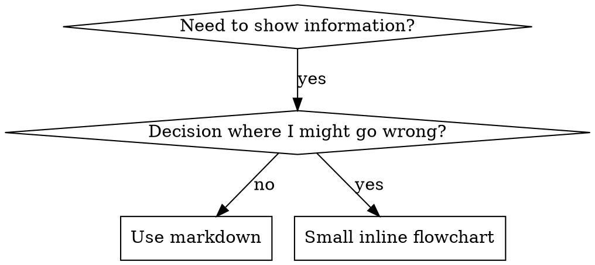

# Writing Skills

## Overview

**Writing skills IS Test-Driven Development applied to process documentation.**

**Personal skills live in the user-level skills directory of your agent.** `~/.agents/skills/` is a widely recognised cross-agent location.

The process has these steps:

1. Write test cases (pressure scenarios with subagents).
2. Watch them fail (baseline behavior).
3. Write the skill (documentation).
4. Watch the tests pass (agents comply).
5. Refactor (close loopholes).

**Core principle:** If you did not watch an agent fail without the skill, you do not know if the skill teaches the right thing.

**REQUIRED BACKGROUND:** You MUST understand godmode:test-driven-development before you use this skill. That skill defines the fundamental RED-GREEN-REFACTOR cycle. This skill adapts TDD to documentation.

**REQUIRED SUB-SKILL:** Invoke godmode:writing-for-agents for the prose itself. It covers the description as a context pointer, the information hierarchy, completion criteria, leading words and the no-op pruning pass. This skill proves that a document changes agent behavior under pressure. writing-for-agents makes the document short and predictable. When the two skills pull in different directions, the pressure test wins. Never prune a Red Flags row or a rationalization entry that a test showed to be load-bearing.

**Prose guidance:** for how to write skill text (structure, wording, what to cut), use `godmode:writing-for-agents`. This skill covers how to test it.

## What is a Skill?

A **skill** is a reference guide for proven techniques, patterns or tools. Skills help future agents find and apply effective approaches.

**Skills are:** Reusable techniques, patterns, tools, reference guides

**Skills are NOT:** Narratives about how you solved a problem one time

## TDD Mapping for Skills

| TDD Concept | Skill Creation |
|-------------|----------------|
| **Test case** | Pressure scenario with subagent |
| **Production code** | Skill document (SKILL.md) |
| **Test fails (RED)** | Agent violates rule without skill (baseline) |
| **Test passes (GREEN)** | Agent complies with skill present |
| **Refactor** | Close loopholes and keep compliance |
| **Write test first** | Run the baseline scenario BEFORE you write the skill |
| **Watch it fail** | Document the exact rationalizations that the agent uses |
| **Minimal code** | Write a skill that addresses those specific violations |
| **Watch it pass** | Verify that the agent now complies |
| **Refactor cycle** | Find new rationalizations → plug → re-verify |

The full skill creation process follows RED-GREEN-REFACTOR.

## When to Create a Skill

**Create when:**
- The technique was not intuitively obvious to you
- You would use this reference again across projects
- The pattern applies broadly (not project-specific)
- Others would benefit

**Don't create for:**
- One-off solutions
- Standard practices that other sources document well
- Project-specific conventions (put them in your instructions file)
- Mechanical constraints (if regex or validation can enforce it, automate it. Keep documentation for judgment calls)

## Skill Types

### Technique
A concrete method with steps to follow (condition-based-waiting, root-cause-tracing)

### Pattern
A way to think about problems (flatten-with-flags, test-invariants)

### Reference
API docs, syntax guides, tool documentation (office docs)

## Directory Structure


```
skills/
  skill-name/
    SKILL.md              # Main reference (required)
    supporting-file.*     # Only if needed
```

**Flat namespace** - all skills are in one searchable namespace

**Separate files for:**
1. **Heavy reference** (100+ lines) - API docs, comprehensive syntax
2. **Reusable tools** - Scripts, utilities, templates

**Keep inline:**
- Principles and concepts
- Code patterns (< 50 lines)
- All other content

## SKILL.md Structure

**Frontmatter (YAML):**
- Two required fields: `name` and `description` (see [agentskills.io/specification](https://agentskills.io/specification) for all supported fields)
- Max 1024 characters total
- `name`: Use only letters, numbers and hyphens (no parentheses, no special chars)
- `description`: Third-person. It describes ONLY when to use the skill (NOT what it does)
  - Start with "Use when..." to focus on triggering conditions
  - Include specific symptoms, situations and contexts
  - **NEVER summarize the process or workflow of the skill** (the SDO section tells why)
  - If possible, keep it under 500 characters

```markdown
---
name: Skill-Name-With-Hyphens
description: Use when [specific triggering conditions and symptoms]
---

# Skill Name

## Overview
What is this? Core principle in 1-2 sentences.

## When to Use
[Small inline flowchart IF decision non-obvious]

Bullet list with SYMPTOMS and use cases
When NOT to use

## Core Pattern (for techniques/patterns)
Before/after code comparison

## Quick Reference
Table or bullets for scanning common operations

## Implementation
Inline code for simple patterns
Link to file for heavy reference or reusable tools

## Common Mistakes
What goes wrong + fixes

## Real-World Impact (optional)
Concrete results
```


## Skill Discovery Optimization (SDO)

**Critical for discovery:** Future agents need to FIND your skill

### 1. Rich Description Field

**Purpose:** Your agent reads the description to decide which skills to load for a given task. Make it answer: "Should I read this skill right now?"

**Format:** Start with "Use when..." to focus on triggering conditions

**CRITICAL: Description = When to Use, NOT What the Skill Does**

The description should ONLY describe triggering conditions. Do NOT summarize the process or workflow of the skill in the description.

**Why this matters:** Tests showed this result. When a description summarizes the workflow of the skill, an agent may follow the description and not read the full skill content. One description said "code review between tasks". It caused an agent to do ONE review, although the flowchart of the skill clearly showed TWO reviews (spec compliance, then code quality).

Then we changed the description to only "Use when executing implementation plans with independent tasks" (no workflow summary). The agent then correctly read the flowchart and followed the two-stage review process.

**The trap:** Descriptions that summarize workflow make a shortcut that agents will take. The skill body becomes documentation that agents skip.

```yaml
# ❌ BAD: Summarizes workflow - agents may follow this instead of reading skill
description: Use when executing plans - dispatches subagent per task with code review between tasks

# ❌ BAD: Too much process detail
description: Use for TDD - write test first, watch it fail, write minimal code, refactor

# ✅ GOOD: Just triggering conditions, no workflow summary
description: Use when executing implementation plans with independent tasks in the current session

# ✅ GOOD: Triggering conditions only
description: Use when implementing any feature or bugfix, before writing implementation code
```

**Content:**
- Use concrete triggers, symptoms and situations that show that this skill applies
- Describe the *problem* (race conditions, inconsistent behavior), not *language-specific symptoms* (setTimeout, sleep)
- Keep triggers technology-agnostic, unless the skill itself is technology-specific
- If the skill is technology-specific, make that explicit in the trigger
- Write in third person (the harness injects it into the system prompt)
- **NEVER summarize the process or workflow of the skill**

```yaml
# ❌ BAD: Too abstract, vague, doesn't include when to use
description: For async testing

# ❌ BAD: First person
description: I can help you with async tests when they're flaky

# ❌ BAD: Mentions technology but skill isn't specific to it
description: Use when tests use setTimeout/sleep and are flaky

# ✅ GOOD: Starts with "Use when", describes problem, no workflow
description: Use when tests have race conditions, timing dependencies, or pass/fail inconsistently

# ✅ GOOD: Technology-specific skill with explicit trigger
description: Use when using React Router and handling authentication redirects
```

### 2. Keyword Coverage

Use words that an agent would search for:
- Error messages: "Hook timed out", "ENOTEMPTY", "race condition"
- Symptoms: "flaky", "hanging", "zombie", "pollution"
- Synonyms: "timeout/hang/freeze", "cleanup/teardown/afterEach"
- Tools: Actual commands, library names, file types

### 3. Descriptive Naming

**Use active voice. Put the verb first:**
- ✅ `creating-skills` not `skill-creation`
- ✅ `condition-based-waiting` not `async-test-helpers`

### 4. Token Efficiency (Critical)

**Problem:** getting-started skills and frequently-referenced skills load into EVERY conversation. Every token counts.

**Target word counts:**
- getting-started workflows: <150 words each
- Frequently-loaded skills: <200 words total
- Other skills: <500 words (be concise there too)

**Techniques:**

**Move details to tool help:**
```bash
# ❌ BAD: Document all flags in SKILL.md
search-conversations supports --text, --both, --after DATE, --before DATE, --limit N

# ✅ GOOD: Reference --help
search-conversations supports multiple modes and filters. Run --help for details.
```

**Use cross-references:**
```markdown
# ❌ BAD: Repeat workflow details
When searching, dispatch subagent with template...
[20 lines of repeated instructions]

# ✅ GOOD: Reference other skill
Always use subagents (50-100x context savings). REQUIRED: Use [other-skill-name] for workflow.
```

**Compress examples:**
```markdown
# ❌ BAD: Verbose example (42 words)
your human partner: "How did we handle authentication errors in React Router before?"
You: I'll search past conversations for React Router authentication patterns.
[Dispatch subagent with search query: "React Router authentication error handling 401"]

# ✅ GOOD: Minimal example (20 words)
Partner: "How did we handle auth errors in React Router?"
You: Searching...
[Dispatch subagent → synthesis]
```

**Remove redundancy:**
- Do not repeat what is in cross-referenced skills
- Do not explain what is obvious from the command
- Do not include multiple examples of the same pattern

**Verification:**
```bash
wc -w skills/path/SKILL.md
# getting-started workflows: aim for <150 each
# Other frequently-loaded: aim for <200 total
```

**Name the skill by what you DO or by its core insight:**
- ✅ `condition-based-waiting` > `async-test-helpers`
- ✅ `using-skills` not `skill-usage`
- ✅ `flatten-with-flags` > `data-structure-refactoring`
- ✅ `root-cause-tracing` > `debugging-techniques`

**Gerunds (-ing) work well for processes:**
- `creating-skills`, `testing-skills`, `debugging-with-logs`
- They are active, and they describe the action that you do

### 5. Cross-Referencing Other Skills

**When you write documentation that references other skills:**

Use only the skill name, with explicit requirement markers:
- ✅ Good: `**REQUIRED SUB-SKILL:** Use godmode:test-driven-development`
- ✅ Good: `**REQUIRED BACKGROUND:** You MUST understand godmode:systematic-debugging`
- ❌ Bad: `See skills/testing/test-driven-development` (unclear if required)
- ❌ Bad: `@skills/testing/test-driven-development/SKILL.md` (force-loads, burns context)

**Why no @ links:** `@` syntax force-loads files immediately. It uses 200k+ context before you need them.

## Flowchart Usage



**Use flowcharts ONLY for:**
- Non-obvious decision points
- Process loops where you might stop too early
- "When to use A vs B" decisions

**Never use flowcharts for:**
- Reference material → Tables, lists
- Code examples → Markdown blocks
- Linear instructions → Numbered lists
- Labels without semantic meaning (step1, helper2)

For graphviz style rules, see `graphviz-conventions.dot` in this directory.

**Visualizing for your human partner:** To render the flowcharts of a skill to SVG, use `render-graphs.js` in this directory:
```bash
node ./render-graphs.js ../some-skill           # Each diagram separately
node ./render-graphs.js ../some-skill --combine # All diagrams in one SVG
```

## Code Examples

**One very good example is better than many mediocre ones**

Choose the most relevant language:
- Testing techniques → TypeScript/JavaScript
- System debugging → Shell/Python
- Data processing → Python

**Good example:**
- Complete and runnable
- Comments that explain WHY
- From a real scenario
- Shows the pattern clearly
- Ready to adapt (not a generic template)

**Don't:**
- Implement in 5+ languages
- Create fill-in-the-blank templates
- Write contrived examples

You can port code well. One very good example is enough.

## File Organization

### Self-Contained Skill
```
defense-in-depth/
  SKILL.md    # Everything inline
```
When: All content fits, and the skill needs no heavy reference

### Skill with Reusable Tool
```
condition-based-waiting/
  SKILL.md    # Overview + patterns
  example.ts  # Working helpers to adapt
```
When: The tool is reusable code, not only narrative

### Skill with Heavy Reference
```
pptx/
  SKILL.md       # Overview + workflows
  pptxgenjs.md   # 600 lines API reference
  ooxml.md       # 500 lines XML structure
  scripts/       # Executable tools
```
When: The reference material is too large for inline

In the prose, invoke bundled scripts through their interpreter (`bash scripts/tool.sh`, `node scripts/tool.js`). Never invoke them by bare path. Some harness plugin packagers remove executable bits. There, a bare `scripts/tool.sh` fails with `Permission denied`.

## The Iron Law (Same as TDD)

```
NO SKILL WITHOUT A FAILING TEST FIRST
```

This applies to NEW skills AND EDITS to existing skills.

Did you write the skill before the test? Remove it. Start over.
Did you edit the skill without a test? It is the same violation.

**No exceptions:**
- Not for "simple additions"
- Not for "just adding a section"
- Not for "documentation updates"
- Do not keep untested changes as "reference"
- Do not "adapt" while you run tests
- Remove means remove

**REQUIRED BACKGROUND:** The godmode:test-driven-development skill explains why this is important. The same principles apply to documentation.

## Testing All Skill Types

Different skill types need different test approaches:

### Discipline-Enforcing Skills (rules/requirements)

**Examples:** TDD, verification-before-completion, designing-before-coding

**Test with:**
- Academic questions: Do they understand the rules?
- Pressure scenarios: Do they comply under stress?
- Multiple pressures godmode: time + sunk cost + exhaustion
- Identify rationalizations, then add explicit counters

**Success criteria:** The agent follows the rule under maximum pressure

### Technique Skills (how-to guides)

**Examples:** condition-based-waiting, root-cause-tracing, defensive-programming

**Test with:**
- Application scenarios: Can they apply the technique correctly?
- Variation scenarios: Do they handle edge cases?
- Missing information tests: Do instructions have gaps?

**Success criteria:** The agent applies the technique to a new scenario with success

### Pattern Skills (mental models)

**Examples:** reducing-complexity, information-hiding concepts

**Test with:**
- Recognition scenarios: Do they recognize when pattern applies?
- Application scenarios: Can they use the mental model?
- Counter-examples: Do they know when NOT to apply?

**Success criteria:** The agent correctly identifies when and how to apply the pattern

### Reference Skills (documentation/APIs)

**Examples:** API documentation, command references, library guides

**Test with:**
- Retrieval scenarios: Can they find the right information?
- Application scenarios: Can they use what they found correctly?
- Gap testing: Does the skill cover common use cases?

**Success criteria:** The agent finds the reference information and applies it correctly

## Common Rationalizations for Skipping Testing

| Excuse | Reality |
|--------|---------|
| "Skill is obviously clear" | Clear to you ≠ clear to other agents. Test it. |
| "It's just a reference" | References can have gaps and unclear sections. Test retrieval. |
| "Testing is overkill" | Untested skills have issues. Always. 15 min of tests saves hours. |
| "I'll test if problems emerge" | Problems = agents cannot use the skill. Test BEFORE you deploy. |
| "Too tedious to test" | A test is less tedious than to debug a bad skill in production. |
| "I'm confident it's good" | Overconfidence guarantees issues. Test anyway. |
| "Academic review is enough" | Reading ≠ using. Test application scenarios. |
| "No time to test" | An untested skill wastes more time later, when you must fix it. |

**All of these mean: Test before you deploy. No exceptions.**

## Match the Form to the Failure

Before you write guidance, classify the baseline failure. The form that bulletproofs one failure type measurably backfires on a different type.

| Baseline failure | Right form | Wrong form |
|---|---|---|
| Skips or violates a rule under pressure (knows the rule, but breaks it anyway) | Prohibition + rationalization table + red flags (see Bulletproofing below) | Soft guidance ("prefer...", "consider...") |
| Complies, but the output has the wrong shape (bloated prompt, buried verdict, restated spec) | Positive recipe or contract: state what the output IS — its parts, in order | Prohibition list ("don't restate", "never narrate") |
| Omits a required element from something that the agent already makes | Structural: a REQUIRED field or slot in the template that the agent fills in | Prose reminders near the template |
| Behavior should depend on a condition | A conditional keyed to an observable predicate ("if the brief exists, reference it") | Unconditional rule + exemption clauses |

**Why prohibitions backfire on shaping problems:** under a competing incentive ("make the prompt self-contained"), agents negotiate with "don't X". We ran head-to-head wording tests on dispatch-prompt guidance. The prohibition arm made clearly more of the unwanted content than the recipe arm (fully separated distributions). It also trended worse than the no-guidance control. Micro-test your own case. Do not assume. But never use the prohibition by default. A recipe leaves nothing to negotiate: the output matches the stated shape or it does not.

**Rules for the form that you pick:**
- **No nuance clauses.** "Don't X unless it matters" opens the negotiation again. In the same wording tests, we added a single nuance clause to a winning recipe. It changed the recipe from consistent to noisy. State a real exception as its own conditional on an observable predicate.
- **Exemption clauses don't scope.** "This limit doesn't apply to code blocks" still suppresses code blocks. If part of the output must be exempt, change the structure so that the rule cannot reach it.

## Bulletproofing Skills Against Rationalization

Skills that enforce discipline (like TDD) must resist rationalization. Agents are smart, and they will find loopholes when they are under pressure.

**Scope:** this toolkit is for discipline failures: an agent that knows the rule and skips it under pressure. For wrong-shaped output or omitted elements, prohibition-based bulletproofing backfires. For those failures, use the forms in Match the Form to the Failure.

**Psychology note:** When you understand WHY persuasion techniques work, you can apply them systematically. See persuasion-principles.md for the research foundation (Cialdini, 2021, and Meincke et al., 2025). It covers the authority, commitment, scarcity, social proof and unity principles.

### Close Every Loophole Explicitly

Do not only state the rule. Forbid specific workarounds:

<!-- ste:off -->
<Bad>
```markdown
Write code before test? Delete it.
```
</Bad>
<!-- ste:on -->

<Good>
```markdown
Write code before test? Delete it. Start over.

**No exceptions:**
- Don't keep it as "reference"
- Don't "adapt" it while writing tests
- Don't look at it
- Delete means delete
```
</Good>

### Address "Spirit vs Letter" Arguments

Add a foundational principle early:

```markdown
**Violating the letter of the rules is violating the spirit of the rules.**
```

This stops the full class of "I'm following the spirit" rationalizations.

### Build Rationalization Table

Capture rationalizations from baseline testing (see the Testing section below). Put each excuse that agents make in the table:

```markdown
| Excuse | Reality |
|--------|---------|
| "Too simple to test" | Simple code breaks. Test takes 30 seconds. |
| "I'll test after" | Tests passing immediately prove nothing. |
| "Tests after achieve same goals" | Tests-after = "what does this do?" Tests-first = "what should this do?" |
```

### Create Red Flags List

Make it easy for agents to see when they rationalize:

```markdown
## Red Flags - STOP and Start Over

- Code before test
- "I already manually tested it"
- "Tests after achieve the same purpose"
- "It's about spirit not ritual"
- "This is different because..."

**All of these mean: Delete code. Start over with TDD.**
```

### Update SDO for Violation Symptoms

Add to the description the symptoms that show that you are ABOUT to violate the rule:

```yaml
description: use when implementing any feature or bugfix, before writing implementation code
```

## RED-GREEN-REFACTOR for Skills

Follow the TDD cycle:

### RED: Write Failing Test (Baseline)

Run a pressure scenario with a subagent WITHOUT the skill. Document the exact behavior:
- What choices did they make?
- What rationalizations did they use (verbatim)?
- Which pressures triggered violations?

This is "watch the test fail". You must see what agents naturally do before you write the skill.

### GREEN: Write Minimal Skill

Write a skill that addresses those specific rationalizations. Do not add extra content for hypothetical cases.

Run the same scenarios WITH the skill. The agent should now comply.

### REFACTOR: Close Loopholes

Did the agent find a new rationalization? Add an explicit counter. Test again until the skill is bulletproof.

### Micro-Test Wording Before Full Scenarios

Full pressure-scenario runs are the final gate. But each iteration is slow and expensive. First, verify the wording itself with micro-tests:

1. **One fresh-context sample per call** — a raw API call. If you do not have API access, use a single-shot subagent. System prompt = the realistic context where the guidance will live (the full skill or prompt template, not the guidance in isolation). User message = a task that tempts the failure.
2. **Always include a no-guidance control.** If the control does not show the failure, there is nothing to fix. Stop. Do not write the guidance.
3. **5+ reps per variant.** Single samples lie.
4. **Manually read every flagged match.** You can score programmatically. But template echoes and quoted counter-examples look like hits. Automated counts alone overstate both failure and success.
5. **Variance is a metric.** When guidance works, reps converge on the same shape. Five different interpretations across five reps means that the wording is not binding. Tighten the form before you add words.

Micro-tests verify wording. They do not replace pressure scenarios for discipline skills.

**Testing methodology:** See [testing-skills-with-subagents.md](testing-skills-with-subagents.md) for the full testing methodology:
- How to write pressure scenarios
- Pressure types (time, sunk cost, authority, exhaustion)
- Plugging holes systematically
- Meta-testing techniques

## Anti-Patterns

### ❌ Narrative Example
"In session 2025-10-03, we found empty projectDir caused..."
**Why bad:** It is too specific and not reusable

### ❌ Multi-Language Dilution
example-js.js, example-py.py, example-go.go
**Why bad:** Mediocre quality, maintenance burden

### ❌ Code in Flowcharts
```dot
step1 [label="import fs"];
step2 [label="read file"];
```
**Why bad:** You cannot copy-paste it, and it is hard to read

### ❌ Generic Labels
helper1, helper2, step3, pattern4
**Why bad:** Labels should have semantic meaning

## STOP: Before Moving to Next Skill

**After you write ANY skill, you MUST STOP and complete the deployment process.**

**Do NOT:**
- Create multiple skills in a batch without a test of each one
- Move to the next skill before you verify the current one
- Skip tests because "batching is more efficient"

**The deployment checklist below is MANDATORY for EACH skill.**

To deploy untested skills = to deploy untested code. It is a violation of quality standards.

## Skill Creation Checklist (TDD Adapted)

**IMPORTANT: Create a todo for EACH checklist item below.**

**RED Phase - Write Failing Test:**
- [ ] Create pressure scenarios (3+ combined pressures for discipline skills)
- [ ] Run scenarios WITHOUT skill - document baseline behavior verbatim
- [ ] Identify patterns in rationalizations/failures

**GREEN Phase - Write Minimal Skill:**
- [ ] Name uses only letters, numbers, hyphens (no parentheses/special chars)
- [ ] YAML frontmatter with required `name` and `description` fields (max 1024 chars, see [spec](https://agentskills.io/specification))
- [ ] Description starts with "Use when..." and includes specific triggers/symptoms
- [ ] Description written in third person
- [ ] Keywords throughout for search (errors, symptoms, tools)
- [ ] Clear overview with core principle
- [ ] Address specific baseline failures identified in RED
- [ ] Guidance form matches the failure type (see Match the Form to the Failure)
- [ ] For behavior-shaping guidance: wording micro-tested against a no-guidance control (5+ reps, every flagged match read manually) — N/A for pure reference skills
- [ ] Code inline OR link to separate file
- [ ] One excellent example (not multi-language)
- [ ] Run scenarios WITH skill - verify agents now comply

**REFACTOR Phase - Close Loopholes:**
- [ ] Identify NEW rationalizations from testing
- [ ] Add explicit counters (if discipline skill)
- [ ] Build rationalization table from all test iterations
- [ ] Create red flags list
- [ ] Re-test until bulletproof

**Quality criteria:**
- [ ] Small flowchart only if decision non-obvious
- [ ] Quick reference table
- [ ] Common mistakes section
- [ ] No narrative storytelling
- [ ] Supporting files only for tools or heavy reference

**Deployment:**
- [ ] Commit skill to git and push to your fork (if configured)
- [ ] Consider contributing back via PR (if broadly useful)

## Discovery Workflow

How future agents find your skill:

1. **Encounters problem** ("tests are flaky")
2. **Searches skills** (greps descriptions, browses categories)
3. **Finds SKILL** (description matches)
4. **Scans overview** (is this relevant?)
5. **Reads patterns** (quick reference table)
6. **Loads example** (only when implementing)

**Optimize for this flow** - put searchable terms early and frequently.
